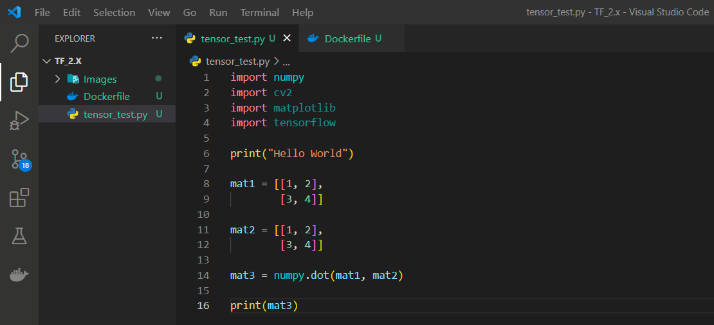

# How to build a TensorFlow-ready container

Open up your preferred editor and create a new folder called tf_2.x. Once that is done, create two files, a “Dockerfile” and another one titled “tensor_test.py”.


In the Dockerfile we will write

```Dockerfile
FROM python:3.7

WORKDIR /TF_2.x

COPY . /TF_2.x/

RUN python -m pip install tensorflow
RUN python -m pip install numpy
RUN python -m pip install opencv-python-headless
RUN python -m pip install matplotlib

CMD python tensor_test.py
```


Similar to the CMD function, RUN executes a command in the shell, however, there can be multiple RUN functions in a Dockerfile. If there are numerous CMD functions then Docker will only consider the last one.

In tensor_test.py, write

``` python
import numpy
import cv2
import matplotlib
import tensorflow

print("Hello World")

mat1 = [[1, 2],
        [3, 4]]
        
mat2 = [[1, 2], 
        [3, 4]]

mat3 = numpy.dot(mat1, mat2)

print(mat3)
```



Here you will import all of the libraries and then make sure that everything is working with a Hello World and a NumPy matrix multiplication.

Once this is finished, open up your command prompt and enter

```shell
docker build -t tf_2.x .
```


When the image has finished building, run it as a container by typing in

```shell
docker run tf_2.x
```


Congratulations! You have just created your first TensorFlow-ready container.
