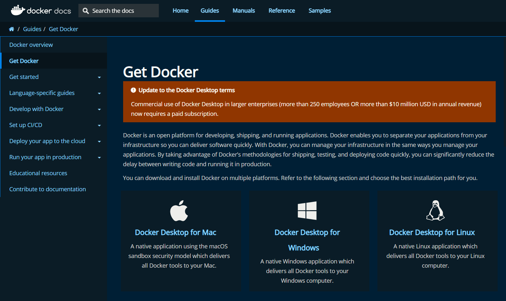
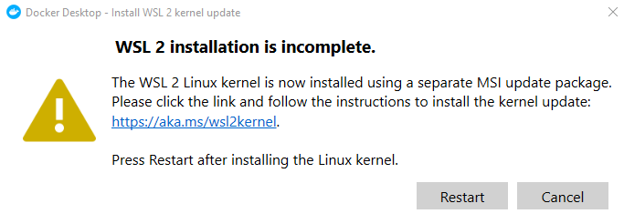
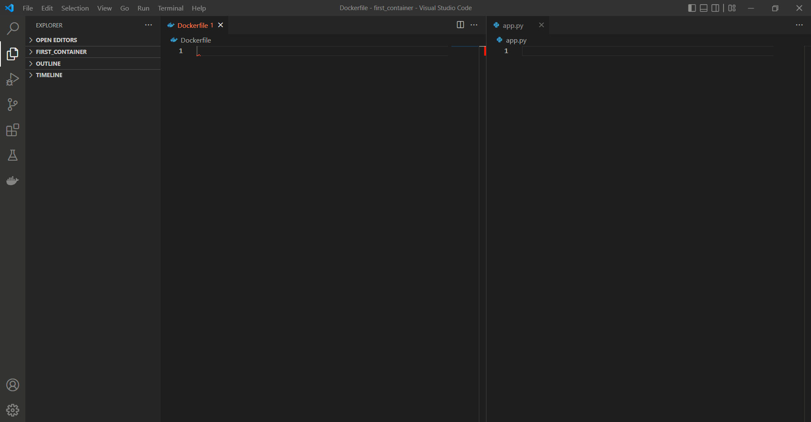
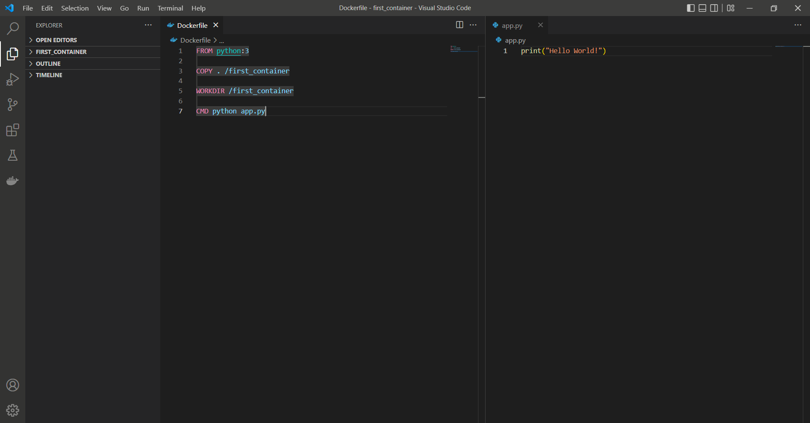
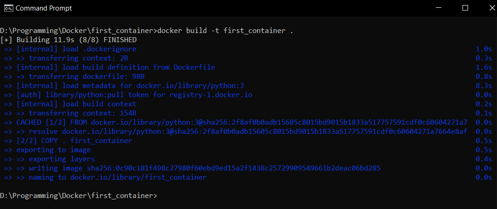

# Docker

## What Is Docker?

Docker is an open-source platform that simplifies building, running, managing, and distributing applications. Docker standardizes all executables necessary to run an application including the source code, all external dependencies, and an OS.

## Why Docker?

Docker makes it significantly easier to maintain and distribute applications to other machines with different libraries, configurations and OS. With Docker, applications are run as intended in an isolated environment regardless of the machine.

## What What are Docker images?

Docker images are the starting point while using Docker. Docker images contains the OS used, the language and release version, all external dependencies and the source codes. Similar to a template or a blueprint, Docker images are the instructions used to builed Docker containers.

## What are Docker containers?

Docker containers are basically live versions of Docker images. They have the same contents as images and are created when an image is run.

## What is a Dockerfile?

A Dockerfile is a text file that tells Docker all of the languages, distributions, dependencies, and files that will be created into an image.

## How to install Docker?

To install Docker click on <https://docs.Docker.com/get-Docker>.



Open the link to your corresponding OS and make sure that your machine meets the system requirements.

Run the Docker installer once downloaded. After Docker has completed unpacking all of the files, run the Docker For Desktop application.



 If you get this error then there is an issue with your Linux kernel. This is a very common issue. Follow the steps in <https://aka.ms/wsl2kernel>. Once that is fixed, restart Docker.

## How to create your first Docker container

For the first project, you will create a Hello World program in Python and run it through a Docker container.

Open up your go-to editor and create a new folder called “first_container”.

In the folder, create two new files. The first one will be “app.py” and the second one will just be called “Dockerfile” with no extension.



In the python file, write

```python
print(“Hello World!”)
```

In the Dockerfile, write

```Dockerfile
FROM python:3
COPY . /first_container
WORKDIR /first_container
CMD python app.py
```



The first line indicates the language and the release version
The second line tells Docker which files to include in the image
The third line changes the working directory to first_container
The fourth line tells Docker what to run in the command prompt

Once this is done, open up your command prompt and type in

```shell
docker build -t first_container .
```



Once the Docker has finished building the image, type

```shell
docker run first_container
```


Congratulations! You have just created your first Docker image and container.
