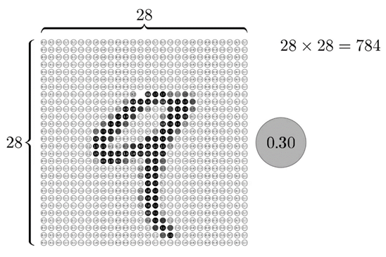

Artificial Intelligence. It’s hard to live in this day and age without hearing about it. But what exactly is Artificial Intelligence? How does the software that controls almost every aspect of our lives work?

# What are artificial neural networks?

Artificial neural networks, also called neural networks, are the backbone of Artificial Intelligence. They are computer systems inspired by the design of the biological neural networks in our brains. They recognize patterns and correlations within data sets, predict various phenomena such as weather patterns, and classify data.

# How do they work?

Neural networks consist of 3 key components: an input layer, the hidden layers, and an output layer.

![Images/Network.png]

Each node in a neural network is called a neuron and holds a value between 1 and 0. The higher this activation number is, the more active a neuron is.

![Images/Nine.png]

Let's take the image of the number 9 above, for example. It has a resolution of 28 by 28 and a colour depth of 1 which means that our total number of bits is

$28 *28* 1 = 784$

Let us assign each bit a number between 1 and 0, indicating how bright each bit is; so that we get

Take each row and line them all together to form one long line of 784 neurons, with each activation number corresponding to their brightness. These 784 neurons make up the first input layer.
The structure of the hidden layers in each neural network is entirely arbitrary. For simplicity, we will consider 2 hidden layers, each with 16 neurons.
In a trained network, the activation of the neurons in one layer will trigger a specific activation pattern in the next layer which will then do the same thing to all following layers, finally triggering one neuron in the output layer corresponding to the label.

# How does a neuron in one layer influence the neurons in the next layer?

Each neuron in one layer is connected to every neuron in the next layer. One neuron in the second layer connects to all 784 neurons in the previous layer. All those neurons play a role in determining the activation number of the neuron in the second layer. Between the input and the second layer, there are a total of 12544 connections.
However, each connection does not make up 1/784 of the activation number of the next neuron. Each connection has a different weight and a bias.

# What are the weights and biases?

Not all neurons in the input layer equally contribute to a neuron in the second layer. They all have their weighted percentages.
Let each of the 784 activation numbers be denoted by $a_{N}^{L-1}$ where $N$ is the number of the neuron and $L$ is the layer number.
This means that the equation for the activation energy of a neuron is not

$$a^{L}_{0}=\sum_{N=1}^{784}\frac{a_{N}^{L-1}}{784}$$

But instead, it is

$$a^{L}_{0}=\sum_{N=1}^{784}w^{L-1}_{N}\cdot a^{L-1}_{N}-b$$

Where $w$ is the weight as a multiplier and $b$ is the bias.
Let's say, for example, that we only want a neuron to be active when its activation number is greater than 5. Then we will adjust the bias by substituting 5 in for $b$ so that the activation number will only be greater than 0 when the weighted sum is greater than 5.
Now, remember that the activation number must be between 0 and 1. To squish our number onto a number line between 0 and 1, we will pass our activation number through a ReLU function.
The Rectified Linear Unit (ReLU) function compresses any number onto a number line between 0 and 1.

# What does learning mean?

Remember that there are only 12544 weights and 16 biases between the first two layers. In the entire network, the total number of weights comes to

$784 *16 + 16* 16 + 16 * 10 = 12960$

While the total number of biases is

$16 + 16 + 10 = 42$

That's a total of 3002 different nobs and dials that the network can configure! So when a network is "learning", all it's doing is figuring out the best possible configurations of weights and biases.

# How does a network determine the optimum configuration of weights and biases?

The network does this by calculating a cost function at the end of every test. The cost function tells the computer how good or bad the configurations of weights and biases are so that the computer can change them accordingly. Then, with calculus, it finds the minimum of the cost function and, thus, the most optimal configuration. Initially, the weights and biases are wholly randomized and, to no surprise, yield a very high cost. All 13,002 weights and biases are taken in as inputs into the cost function, which then spits out a single accuracy number. The cost will be very high for tests where the labelling was inaccurate. However, for more accurate labelling, the cost will be lower.
But just telling the network that it needs to adjust its configurations isn't exactly helpful. The computer needs to know which biases need to change and how much.

# How does the computer know which direction to shift and how much?

Imagine a function which takes in one input and has one output. How does the computer find an input that minimizes the output of the function? For our specific function, we could calculate the derivative explicitly. However, this is not a feasible method for a function with 13,002 inputs. A more efficient solution would be to start somewhere random on the function and figure out which direction the input should move in to reduce the output. We can do this by calculating the gradient at a certain point. If the gradient is positive, the computer knows that the input has to shift in the negative x direction and vice versa. If this process is done repeatedly, checking the slope and taking a step accordingly, the computer will arrive at a local minimum at some point. The method of doing this is called Gradient Descent.
It is important to note that for a more complex function, there are many different local minimums that the computer can arrive at, and depending on the starting point, the local minimum reached will vary.

# What is backpropagation?

Let's say, for example, that we are classifying a picture of the number two.
In the output layer, we want to increase the activation number for the neuron corresponding to a two and decrease all other activation numbers.

Now that we know which neuron's values we want to increase or decrease and by how much, how do we change the activation number of those neurons? The computer uses a process called backpropagation to do this. If we want to change a neuron's activation number, it can be accomplished by changing one of three things.

* The weights
* The bias
* The activation number of previous neurons

Let us take a closer look at the neuron corresponding to a two.
Notice how the brighter neurons in the previous layer have a much stronger influence on our neuron. This is because the weight is multiplied by a very high activation number, thus giving that neuron a product. So if you were to increase or decrease the weights on brighter neurons, it would have a much more significant effect on the overall cost function than increasing the weight of the dimmer neurons. The next way we can increase our neuron's activation number is by changing all the activation numbers in the previous layer. If everything connected to our neuron with a positive weight got brighter, and everything with a negative weight got dimmer, our neuron would become more active. However, these are the changes desired by just our neuron. Each of the other output neurons has its own desired changes to the weights and biases to make them less active. All the changes and nudges to the weights are averaged to give one overall change to the weights of each neuron. This process is then repeated with the previous layer and so on. This is where the idea of propagating backwards comes from.
However, our picture of the number two isn't the only one being classified. Other numbers will also have their averages of weights and biases for each separate image. The network takes an average of all averages to reach one final set of 13,002 weights and biases.

# Is this how all Artificial Intelligence works?

This specific type of Neural Network is incredibly outdated and slow. Much more efficient network types exist that are used for much more complicated tasks than merely labelling a handwritten number, such as Siri or Tesla’s auto drive. However, to learn anything, one must first start at the basics.
